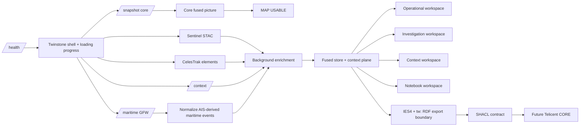

# Twinstone v1.0.0 — First Controlled Git Baseline

Twinstone is a browser-based OSINT fusion and assurance proof of concept. It combines independently sourced public data, retains provenance and source semantics, performs objective/derivable operations deterministically, and uses an LLM only for explanation and assessment over the evidence package supplied to it.

v1.0.0 is the first **controlled Git baseline** for Twinstone. It carries forward the capabilities developed during the pre-Git prototype series through v1.10.3 — including workspaces, progressive startup, explainable deterministic assessment, IES4/CORE readiness and credential-gated Global Fishing Watch maritime activity — but resets release numbering so future versions represent tested, source-controlled releases rather than reconstructed prototype history.

The baseline also fixes the first defects exposed by the automated pipeline: stale hard-coded User-Agent versions and loss of FIRMS/UCDP product/version provenance before observations reached Gemini. The repository contract, permanent architectural/epistemic rules and CI test suite are now part of the controlled baseline.

---

## Runtime

The demo still requires only:

- `twinstone.html` on the demo machine.
- The deployed Cloudflare Worker from `worker.js`.
- Ordinary HTTPS connectivity to the configured/open data services.

No Python, Docker, local database or Telicent runtime is required on the demo machine.

Supporting ontology, SHACL, migration and diagnostic files are retained in the release package because they document and validate the engineering architecture, but they are not required beside `twinstone.html` for normal demo operation.

---

## Current capability baseline

### Spatial / physical evidence

- Aircraft positions from the qualified aircraft route, with reusable regional acquisition cells and last-known-good handling.
- CelesTrak satellite orbital elements with browser-side SGP4 position estimates.
- Copernicus Sentinel-1 and Sentinel-2 catalogue acquisitions.
- Human-viewable Copernicus Process API imagery where credentials are configured.
- Deterministic Sentinel before/after change screening with valid-pixel/common-coverage assurance gates.
- NASA FIRMS VIIRS thermal-anomaly clustering and FRP screening.
- USGS earthquakes.
- Open-Meteo weather retained as fused context but not plotted as a distracting map point.
- UCDP Candidate reported conflict events when `UCDP_ACCESS_TOKEN` is configured.

### Maritime activity intelligence

- Global Fishing Watch v3 Events API when `GFW_API_TOKEN` is configured.
- Apparent fishing events.
- Vessel encounter events.
- Loitering events.
- Port-visit events with source confidence retained where supplied.
- AIS-gap events with the GFW prototype-quality caveat retained.
- Persistent vessel identity uses `ies:Ship` where GFW supplies a vessel identifier/MMSI.
- Maritime activity is not presented as live AIS/vessel-position telemetry and does not automatically increase the deterministic corroboration score.

### Deterministic fusion / assurance

- Temporal last-known-good retention and freshness classification.
- Deterministic cross-source spatial/temporal association.
- FIRMS ↔ EO change association.
- UCDP ↔ FIRMS and UCDP ↔ EO association.
- Closed three-source evidence chains only when qualifying pairwise relationships exist.
- 20 km corroboration/watchlist cells with transparent five-factor deterministic scoring.
- Investigation-wide explainable evidence assessment.
- Adjacent-window **What changed?** comparison with explicit historical-coverage caveats.
- Observation / derived estimate / reported event / assessment distinctions retained throughout.

### Analyst workflow

- Global overview plus fixed Ukraine and English Channel profiles.
- Dynamic Investigation AOIs anywhere supported by the available regional sources.
- 10 / 25 / 50 / 100 km AOI sizes.
- 6 h / 24 h / 3 d / 7 d / 30 d analysis windows.
- Timeline/replay over retained browser-session history.
- Investigation notebook with analyst notes, assessment, gaps and stable pinned evidence references.
- JSON notebook export.
- Gemini 3.6 Flash analyst over reduced evidence packages and deterministic summaries.

### OSINT context plane

Context is deliberately separate from corroborating physical evidence unless a future explicit rule promotes a particular source/use case.

- IODA connectivity/outage context.
- NOAA SWPC space-weather context.
- ReliefWeb humanitarian reporting when a pre-approved app name is configured.
- WHO Disease Outbreak News context.
- Country/state scope metadata resolved conservatively for Investigation AOIs.

---

## Maritime activity (carried into v1.0.0 from pre-Git v1.10.3)

Global Fishing Watch is loaded as a **background enrichment branch**, not as part of `/snapshot`. The Worker exposes:

```text
GET /maritime
```

The route uses the GFW v3 Events API with the bearer token stored server-side as `GFW_API_TOKEN`. It sends the selected regional/AOI bounding box as a GeoJSON polygon and requests the current `latest` datasets for apparent fishing, encounters, loitering, port visits and AIS gaps. The response is capped, cached for 30 minutes, and retained as a 24-hour stale fallback if the upstream API later degrades.

A source-aware minimum seven-day retrieval window is used because GFW is an AIS-derived event-history source rather than live vessel telemetry. Every record keeps its actual GFW event timestamp. A zero-event result therefore means only that no qualifying GFW events were returned for the requested geometry/time retrieval — it is **not evidence of zero vessel activity**.

**Provider-terms note:** the current Global Fishing Watch API documentation states that its APIs are available for non-commercial purposes and requires users to agree to the provider terms and attribution requirements. Twinstone therefore treats this adapter as a PoC/demo integration until the intended deployment use has been checked against those terms.

### Maritime epistemic boundaries

- **Apparent fishing** is the GFW algorithmic classification; Twinstone does not independently confirm that fishing occurred.
- **Encounter** is an AIS-derived proximity/activity indicator and does not establish transshipment, transfer, intent or wrongdoing.
- **Loitering** is an AIS-derived movement pattern and does not establish an encounter, transshipment or intent.
- **Port visit** is AIS-derived rather than direct port-authority confirmation; GFW confidence is retained where supplied.
- **AIS gap** retains the GFW prototype-quality caveat. Twinstone does not independently establish deliberate disabling, cause or intent from a gap record alone.

The operational map uses a distinct hollow/ringed maritime symbol so GFW activity cannot be confused with the solid diamond reserved for an actual vessel-position feed. Event type is also retained in the popup and analyst evidence package.

## Workspace layout stability (introduced pre-Git v1.10.2)

The v1.10.1 collapse implementation hid grid children without assigning them explicit grid areas. In CSS Grid, hidden children are removed from auto-placement, so the map could be reassigned into a zero-width column when the left panel or both sidebars were hidden. v1.10.2 assigns explicit `left`, `map`, and `right` grid areas so the map remains in the centre track regardless of panel visibility.

The panel controls now also reflect their current state: the arrows reverse when a panel is hidden, tooltips switch between **Hide** and **Show**, and **Full map** changes to **Restore view** while presentation mode is active. Leaflet receives a two-stage `invalidateSize()` after layout changes so map tiles and overlays resize reliably.

## Workspaces and progressive startup (introduced pre-Git v1.10.1)

The top navigation separates **what the analyst is doing** from **where the analyst is looking**:

- **Operational** — map-first view, geographic selection, layers, source status, timeline and live analyst.
- **Investigation** — evidence-first workspace with deterministic score, evidence counts, score deficits, strengthening evidence and adjacent-window comparison.
- **Context** — IODA, NOAA SWPC, ReliefWeb and WHO context without forcing those feeds onto the map.
- **Notebook** — analyst notes, assessment, gaps and pinned stable evidence references.

The geographic selector remains independent: Ukraine, English Channel, Global overview or a dynamic Investigation AOI.

### Screen decongestion

- Left-side sections are filtered to the active workspace instead of all being visible at once.
- Left and right sidebars can be collapsed independently.
- **Full map** presentation mode hides both sidebars and the timeline.
- The map legend is dynamic and lists only currently enabled evidence classes with non-zero records.
- The timeline is principally visible in Operational and Investigation views and hidden in Context/Notebook views.

---

## Progressive startup

The original startup sequence effectively waited for the Worker snapshot before beginning Sentinel and satellite acquisition. v1.10.1 launches independent acquisition branches concurrently after Worker health succeeds.

A startup window reports live progress for:

1. Worker connection
2. Operational feeds
3. Sentinel catalogue
4. Satellite elements
5. Investigation context

The application becomes usable as soon as the **core snapshot** is available. Sentinel, satellites and context continue enriching in the background. A compact `Sync n/5` indicator continues to show enrichment progress after the startup window closes; the fifth branch is credential-gated maritime activity.

### Context removed from the core critical path

v1.10.0 started context acquisition in parallel inside `/snapshot`, but `/snapshot` still awaited those context calls before returning. v1.10.1 separates context into:

```text
GET /context
```

The core snapshot can therefore return without waiting for IODA, SWPC, ReliefWeb or WHO.

### Fast-start acquisition

Browser-direct CelesTrak and Copernicus STAC startup attempts use shorter fast-start timeouts and fall back sooner to Worker routes. This favours a quick first usable picture followed by resilient background enrichment rather than allowing one slow direct connection to make the interface appear frozen.

---

## v1.0.0 data flow

The controlled baseline retains the layout-stability fix and the fifth asynchronous enrichment branch for Global Fishing Watch, keeping maritime API latency and credentials off the core snapshot path. All workspaces consume the same fused state rather than duplicating acquisition pipelines.



---

## Evidence and semantic boundaries

These rules have been progressively introduced and are retained in the current baseline:

- **FIRMS** is a satellite thermal-anomaly/active-fire-like detection source. It does not by itself establish attack, explosion, damage, actor, intent or attribution.
- **Sentinel change** means sensor values changed between two valid acquisitions. It does not establish cause, object type, damage, actor, intent or attribution.
- **UCDP** is reported/coded conflict-event evidence, not a physical sensor observation.
- **Global Fishing Watch maritime activity** is AIS-derived algorithmic event evidence/history, not live vessel-position telemetry. Event classification does not independently establish confirmed fishing, transshipment, deliberate AIS disabling, cause, intent or wrongdoing.
- **Satellite position** is a propagated SGP4 estimate from orbital elements, not a direct position observation.
- **Cross-source association** is a deterministic spatial/temporal relationship, not causation.
- **Three-source evidence chains** represent qualifying independent evidence relationships, not proof of a common cause.
- **Context sources** support analyst understanding but do not automatically increase deterministic corroboration.
- **Notebook material** is analyst-authored and cannot become independent evidence simply because it is stored beside source records.
- **Missing source data is not zero activity.** Historical-window comparisons explicitly distinguish complete, partial and interaction-derived lookback.
- **No-data imagery is not no-change.** Sentinel comparison validity depends on usable/common pixel coverage.

---

## Temporal/freshness model

Twinstone retains last-known-good observations rather than treating omission from a later feed response as disappearance. Map marker shape/fill represents evidence type; the outline represents temporal state:

- green outline — current/recent
- amber outline — ageing
- red outline — stale / last known

Expiry windows differ by evidence class. Satellite freshness is based on source element epoch rather than the current propagation timestamp. GFW maritime activity uses longer event-history freshness windows than live aircraft/vessel telemetry because it is an activity-history source.

---

## Map symbol model

Shape is used alongside colour to make source/evidence classes easier to distinguish:

- Aircraft — triangle, rotated by heading/track where available.
- Vessel/ship position — solid diamond.
- GFW maritime activity — hollow/ringed diamond; event subtype is retained separately.
- Satellite — star.
- Sentinel-1 — square.
- Sentinel-2 — pentagon.
- FIRMS thermal cluster — hexagon.
- UCDP reported event — X.
- EO change region — plus.
- Pairwise association — diamond plus line.
- Closed three-source chain — star.
- Corroboration/watchlist area — analysis-cell square/outline.
- Earthquake — circle.

Weather remains available to the fused picture/agent but is intentionally not plotted as a map point.

---

## Corroboration scoring

The watchlist and investigation assessment use the same transparent deterministic factors:

- Independent evidence classes — 30 points
- Recency — 25 points
- Spatial coherence — 20 points
- Temporal coherence — 15 points
- Evidence/source quality — 10 points

The result is an evidence/corroboration score, **not a probability, threat score or targeting score**. UCDP date-only records are prevented from receiving unjustified timestamp-level temporal precision.

---

## IES4 / Telicent CORE readiness

Twinstone is not currently running on Telicent CORE, but the project has deliberately begun the migration path.

Current compatibility foundation includes:

- IES4 namespace plus a controlled Twinstone extension namespace.
- Deterministic stable knowledge identities under `https://twinstone.local/id/`.
- Runtime IDs retained separately for traceability.
- Controlled `core/ies-mapping.json` mapping register.
- `core/twinstone-shapes.ttl` SHACL validation contract.
- RDF/Turtle export boundary.
- Candidate CORE-style record envelope.
- Separate Telicent ontology presentation styles.
- Migration notes in `core/CORE_MIGRATION.md`.

The demo remains HTML + Worker. A standalone Python/Telicent mapper and real CORE runtime are intentionally deferred until a suitable engineering environment is available.

---

## Configuration

Common current Worker secrets/variables include, where configured:

```text
GEMINI_API_KEY                 # Gemini analyst
FIRMS_MAP_KEY                  # NASA FIRMS
COPERNICUS_CLIENT_ID           # Copernicus Process API OAuth
COPERNICUS_CLIENT_SECRET       # Copernicus Process API OAuth
UCDP_ACCESS_TOKEN              # x-ucdp-access-token header
UCDP_API_VERSION=26.1          # optional override; current fallback is 26.1
GFW_API_TOKEN                  # Global Fishing Watch v3 bearer token for /maritime
RELIEFWEB_APPNAME              # optional pre-approved ReliefWeb application name
```

Other candidate-source credentials remain optional and are not required for the core demo.

Secrets stay server-side in the Cloudflare Worker and are never deliberately returned to the browser.

---

# Release history

Twinstone v1.0.0 is the first release under Git source control with a green automated pipeline and explicit repository rules. Earlier version labels are preserved below as **pre-Git development history**; they are not reconstructed as synthetic Git commits or tags.

## v1.0 — Controlled Git releases

### v1.0.0 — First Controlled Git Baseline

- Established the first controlled source baseline for Twinstone rather than importing synthetic Git history for the prototype series.
- Added/activated `TWINSTONE_RULES.md` as the repository-level architectural and epistemic source of truth.
- Retained `CONTRACT.md` as the concrete testable pipeline contract.
- Added GitHub Actions pipeline execution for `npm ci` + `npm test` with no production secrets required.
- Added a cross-platform Node test launcher (`scripts/run-tests.mjs`) so the same `npm test` command discovers the suite correctly on Windows PowerShell/cmd and Linux CI without relying on shell glob expansion.
- Controlled pipeline now contains **68 test cases across 12 check categories**, including version/visible-badge consistency and permanent-rules assurance.
- Fixed stale hard-coded User-Agent versions so adapters interpolate the canonical runtime `VERSION`.
- Fixed `compactObservation()` so FIRMS `provenance.sourceDataProduct` and UCDP `provenance.sourceDataVersion` survive normalization into the Gemini evidence package.
- Strengthened version checks so package metadata moves with Worker, browser, diagnostics, CORE mapping and README release metadata.
- Strengthened semantic tests so the permanent rules file itself is checked for key assurance boundaries.
- Preserved the full pre-Git design progression below for traceability.

## Pre-Git development history

The following labels describe prototype iterations created before this repository became the authoritative source of history. Their changes are retained because they explain why the controlled baseline has its current architecture.

## v1.10.x — OSINT context and analyst workspaces

### v1.10.3 — Global Fishing Watch Maritime Activity

- Added credential-gated `GET /maritime` background enrichment route using the Global Fishing Watch v3 Events API.
- Kept GFW off `/snapshot` so maritime latency cannot delay the first usable map.
- Added `GFW_API_TOKEN` server-side bearer-token support.
- Added bounded GeoJSON AOI/region queries for the current GFW `latest` apparent-fishing, encounter, loitering, port-visit and AIS-gap datasets.
- Added 30-minute fresh cache and 24-hour stale fallback.
- Added a source-aware minimum seven-day retrieval window while preserving original GFW event timestamps.
- Added `tw:MaritimeActivityObservation` with persistent `ies:Ship` identity where GFW vessel identity is available.
- Added explicit maritime-event semantics and SHACL requirement for an interpretation boundary.
- Added optional maritime activity map layer with a symbol distinct from live vessel-position markers.
- Added Investigation workspace maritime counts and subtype summary.
- Added a Maritime quick query and deterministic/agent handling for GFW activity.
- Added startup/sync maritime enrichment as the fifth background branch (`Sync n/5`).
- Preserved source caveats: apparent fishing is not independently confirmed fishing; encounter/loitering do not prove transshipment or intent; AIS gaps remain prototype-quality and do not independently prove deliberate disabling.
- Updated ontology, IES mapping register, SHACL contract, Telicent presentation style, CORE migration notes and version-specific Mermaid architecture.

### v1.10.2 — Workspace Layout Stability

- Fixed left-sidebar collapse causing CSS Grid auto-placement to move the map into the wrong column.
- Fixed **Full map** presentation mode producing an empty/dark centre instead of a full-width Leaflet map.
- Assigned explicit `left / map / right` CSS grid areas so hidden sidebars cannot change map placement.
- Made sidebar arrow direction stateful: arrows now indicate the action that will occur next.
- Added **Hide/Show** tooltips and ARIA labels for both panel controls.
- Changed **Full map** to **Restore view** while presentation mode is active.
- Added two-stage Leaflet `invalidateSize()` after layout transitions for reliable tile/overlay resizing.
- No evidence, context, source-adapter, scoring, ontology or CORE semantic behaviour changed.

### v1.10.1 — Workspaces + Progressive Startup

- Added **Operational / Investigation / Context / Notebook** workspaces.
- Separated analyst task/workspace selection from geographic/profile selection.
- Added collapsible left source panel and right analyst panel.
- Added **Full map** presentation mode.
- Added dynamic legend based on enabled, populated evidence classes.
- Kept timeline principally in Operational/Investigation workspaces.
- Added startup/progress window with per-branch acquisition state.
- Added background `Sync n/4` enrichment indicator.
- Changed readiness semantics from “all acquisition finished” to “core picture usable + background enrichment”.
- Launched core snapshot, Sentinel, satellites and context concurrently after `/health`.
- Added Worker `/context` endpoint.
- Removed IODA/SWPC/ReliefWeb/WHO from the `/snapshot` critical path.
- Shortened browser-direct Sentinel/CelesTrak fast-start timeouts while retaining fallback/resilience routes.
- Updated version-specific Mermaid architecture, CORE migration notes and cumulative changelog.

### v1.10.0 — OSINT Context Expansion

- Added a separate non-map **context plane**.
- Added IODA connectivity/outage context.
- Added NOAA SWPC planetary Kp, scales and recent space-weather alert context.
- Added ReliefWeb humanitarian reporting path with explicit `registration-required` state until `RELIEFWEB_APPNAME` is configured.
- Added WHO Disease Outbreak News context.
- Added conservative geographic/country scope resolution for Investigation AOIs.
- Kept context sources outside deterministic corroboration by default.
- Added explicit semantic/context classes and SHACL boundaries so context is not silently promoted to physical evidence.
- Added Context quick-query support for the analyst.

## v1.9.x — Dynamic investigations and analyst workflow

### v1.9.4 — Aircraft Investigation Resilience

- Reworked dynamic-AOI aircraft acquisition around reusable regional acquisition cells rather than unique cache keys for every arbitrary investigation rectangle.
- Added deterministic filtering from the regional aircraft picture back to the selected AOI.
- Added fresh-cache/stale-cache/last-known-good aircraft retention behaviour.
- Added clearer aircraft source states: live, cached/fallback, degraded and unavailable semantics rather than interpreting upstream failure as a genuine zero-aircraft picture.
- Added bounded OpenSky anonymous cold-start fallback when ADSB.lol is unavailable and no useful regional cache exists.
- Kept the unreliable Worker OpenSky OAuth path out of the operational critical chain.
- Updated built-in UCDP API fallback version to `26.1` while retaining the Worker-variable override.

### v1.9.3 — Explainable Evidence Assessment + What Changed

- Added deterministic investigation-wide evidence assessment using the five-factor scoring model.
- Added **Why isn't this higher?** explanations derived from factor deficits rather than generated by Gemini.
- Added **What would strengthen it?** evidence-gap suggestions derived from the deterministic score model.
- Added current-window versus immediately preceding equivalent-window comparison.
- Added per-source historical coverage status so missing history is not interpreted as zero activity.
- Kept the score explicitly separate from probability/threat/targeting semantics.

### v1.9.2 — Investigation Notebook

- Added per-investigation notebook workspace/modal.
- Added analyst notes, assessment and unknown/data-gap fields.
- Added **Pin to notebook** from map evidence popups.
- Pinned stable Twinstone knowledge identity, runtime/source IDs, observation time and provenance rather than screenshots/copied claims.
- Prevented duplicate evidence pins by stable identity.
- Added notebook JSON export.
- Labelled notebook content as analyst-authored so it cannot silently increase source corroboration.

### v1.9.1 — Timeline / Replay

- Added browser-session observation history.
- Added timeline/replay control with live and historical cut-off views.
- Added ±1 h and -6 h stepping controls.
- Historical analyst queries are restricted to observations available at/before the replay cut-off.
- Excluded continuously propagated satellite-position estimates from the history buffer to avoid browser-history explosion.

### v1.9.0 — Dynamic Investigation Areas

- Added **Global → Pick on map → Investigation AOI** workflow.
- Added 10 / 25 / 50 / 100 km AOI sizes.
- Added 6 h / 24 h / 3 d / 7 d / 30 d analysis windows.
- Added session investigation naming/switching/renaming.
- Activated bounded regional feeds automatically for selected AOIs where source capability permits.
- Retained Ukraine and English Channel as convenient fixed profiles.

## v1.8.x — IES4 / Telicent CORE compatibility foundation

### v1.8.1 — IES4 Mapping Foundation

- Added deterministic stable knowledge identities under `https://twinstone.local/id/`.
- Separated stable knowledge IDs from transient runtime IDs.
- Added controlled `core/ies-mapping.json` mapping register.
- Added `core/twinstone-shapes.ttl` SHACL validation contract.
- Added validation expectations for provenance, timestamps, source-data epoch, derivation links and evidence boundaries.
- Changed derived relationships to point to stable evidence identities.
- Added `tw:identityKey`, `tw:identityScheme` and `tw:runtimeId` ontology properties.
- Kept uncertain IES mappings explicitly partial/compatibility-level rather than guessing semantic hierarchy.

### v1.8.0 — Telicent CORE Compatibility Foundation

- Declared the ontology as **IES4 + Twinstone extension** rather than a stand-alone Twinstone vocabulary.
- Added RDF/Turtle export of the retained fused picture.
- Added candidate CORE-style record envelope metadata.
- Added explicit security-label placeholder/gate rather than inventing a deployment ABAC policy.
- Added `core/CORE_MIGRATION.md`.
- Added separate Telicent-style ontology presentation file so map/UI styling remains separate from semantic meaning.
- Documented the target migration path: source adapters → mapping/validation → RDF knowledge → future CORE/Smart-Cache GRAPH.
- Kept the operational demo independent of Python, Docker and CORE runtime.

## v1.7.x — Corroboration workflow, map readability and global view

### v1.7.3 — Global Overview

- Added **Global overview** profile.
- Enabled globally meaningful USGS earthquake acquisition.
- Made global CelesTrak satellites available on demand to avoid rendering thousands of markers by default.
- Kept high-volume/regional sources such as FIRMS, UCDP, Sentinel, aircraft and point weather bounded to regional/investigation use.
- Established the architectural direction **global overview → choose AOI → activate richer regional fusion**.

### v1.7.2 — Evidence Shape Language

- Added different marker shapes for major data/evidence types rather than relying mainly on colour.
- Added heading-rotated aircraft triangle.
- Added vessel diamond, satellite star, Sentinel shapes, FIRMS hexagon, UCDP X, EO-change plus, association/chain/watchlist shapes and earthquake circle.
- Retained freshness as an independent marker-outline property.
- Added separate Aircraft and Vessels layer controls and vessel count readiness.

### v1.7.1 — Watchlist Readability

- Fixed CSS rule interaction that constrained the watchlist/evidence viewer to a narrow card width.
- Widened the viewer and improved spacing/typography.
- Separated overall deterministic score from component-factor scores.
- Added clearer labels/explanations for the five score components.
- Reworked evidence records into labelled fields rather than compressed text.
- Renamed single-source cases from misleading “Corroboration area” wording to watchlist/evidence-area wording.
- Distinguished single-source watchlist evidence, multi-source corroboration and three-source corroboration.

### v1.7.0 — Corroboration Watchlist

- Added deterministic 20 km analysis cells.
- Added top-five corroboration/watchlist ranking.
- Added 6 h / 24 h / 3 d / 7 d windows, later extended by investigation workflow.
- Added five-factor score: independent evidence classes, recency, spatial coherence, temporal coherence and evidence quality.
- Added click-through evidence viewer.
- Added UCDP temporal-precision safeguard so date-only reporting cannot receive unjustified timestamp-level temporal confidence.
- Kept scoring as evidence quality/corroboration, not targeting/threat ranking.

## v1.6.x — Thermal, EO assurance and reported conflict fusion

### v1.6.3 — UCDP Event Fusion

- Added UCDP Candidate GED reported conflict events as a distinct evidence type.
- Preserved UCDP event ID, source/API version, date/geographic precision, actors/conflict/dyad and fatality uncertainty/provenance fields where available.
- Preserved date-only semantics rather than inventing time of day.
- Added deterministic UCDP ↔ FIRMS association.
- Added deterministic UCDP ↔ EO-change association.
- Added closed three-source evidence chain when UCDP, FIRMS and EO-change evidence form qualifying pairwise relationships.
- Prevented imprecise UCDP source dates from entering strict three-source temporal correlation.
- Added map-layer controls for reported events, pairwise associations and chains.
- Extended deterministic summaries for reported events and evidence chains.

### v1.6.2 — Sentinel Common-Coverage Assurance

- Fixed the Sentinel no-data/common-coverage flaw discovered when Process API imagery returned blank/transparent current imagery despite valid catalogue metadata.
- Retained STAC footprint geometry rather than relying only on bbox centroid.
- Added geometry-aware/common-overlap selection for before/after imagery.
- Added valid-pixel coverage checks for each processed image.
- Added common/paired usable-coverage validation.
- Prevented an insufficient-coverage comparison from being reported as “0 change regions”.
- Prevented invalid comparisons from generating EO-change evidence or downstream FIRMS associations.
- Included usable coverage in comparison-quality semantics instead of relying on orbit/cloud metadata alone.
- Prevented effectively empty imagery from being treated as a valid map overlay.
- Reinforced the assurance principle: **no data ≠ no change**.

### v1.6.1 — Thermal/Agent/UI Tidy-up

- Removed the weather marker from the map while retaining weather in fusion, health and analyst context.
- Added deterministic thermal/association summary handling for broad FIRMS questions before Gemini.
- Reduced broad thermal evidence packages sent to the agent.
- Added response validation/fallback for malformed/bare coordinate/timestamp Gemini responses.
- Improved disabled Sentinel control labels/tooltips.
- Added the first release-specific README Mermaid architecture diagram requirement.

### v1.6.0 — NASA FIRMS Operational Fusion

- Operationalised NASA FIRMS VIIRS NOAA-20 NRT ingestion through the Worker.
- Filtered low-confidence detections from the operational clustering path.
- Added deterministic clustering at approximately 1.5 km / 90 min.
- Added cluster metrics including detection count, interval, total/max/mean FRP, brightness, confidence mix, day/night, sensor and extent.
- Added relative FRP tiering without converting thermal strength into event/cause attribution.
- Added explicit `cause: unknown` semantics.
- Added deterministic FIRMS ↔ EO-change spatial/temporal association.
- Added cross-source association ontology type and map visualisation.
- Reinforced that thermal anomalies and EO correlations do not establish attack/strike/cause.

## v1.5.x — Operational hybrid and Earth observation

### v1.5.2 — Deterministic Sentinel Change Screening

- Added Sentinel before/after acquisition pairing.
- Added deterministic block-level image comparison.
- Added robust median/MAD-derived thresholds with mission-specific floors.
- Added connected-component change-region extraction and georeferencing.
- Added changed-area estimates and comparison-quality metadata.
- Kept cause/object/damage/actor/intent unknown.

### v1.5.1 — Copernicus Process Imagery

- Added server-side Copernicus OAuth path.
- Added Sentinel Process API imagery rendering.
- Added Sentinel-2 true-colour processing.
- Added Sentinel-1 terrain-corrected VV intensity rendering.
- Added human-viewable imagery inspection and map overlay.
- Kept tokens/secrets server-side.

### v1.5 — Operational Hybrid

- Consolidated browser-direct and Worker-proxied qualified routes into the operational demo architecture.
- Retained browser-first routes where reliable and Worker fallback/proxy for protected or constrained routes.
- Froze unreliable WebSocket/AIS transport out of the critical demo path.
- Formalised source qualification rather than assuming every discovered API was operationally usable.

## v1.4.x — Connectivity/source qualification

### v1.4.1 — Source Qualification

- Added richer source-qualification diagnostics.
- Distinguished reachable, usable, credential-required, degraded and unsuitable-for-demo source states.
- Qualified browser vs Worker transport behaviour for the major source candidates.
- Established a repeatable basis for deciding which feeds enter the operational path.

### v1.4 — Connectivity Diagnostic

- Added dedicated connectivity/source diagnostics to determine what the restricted demo environment could actually reach.
- Identified browser CORS, Worker egress, authentication and transport constraints separately.

### v1.3 — Local Bridge Exploration

- Explored a local bridge/proxy approach to work around browser/Worker restrictions.
- Abandoned it for the intended demo machine because the target environment could not rely on local Python/PowerShell tooling.
- Retained the browser + Worker deployment constraint.

## v1.0–v1.2 — Aircraft transport resilience

### v1.2 — OpenSky OAuth Resilience Attempt

- Added more robust OpenSky OAuth timeout/retry/token-cache handling.
- Confirmed OpenSky could work locally but Worker access remained unreliable/timed out in the qualified environment.
- Kept OpenSky out of the critical operational path.

### v1.1 — Aircraft Provider Pool

- Introduced provider-pool/fallback logic for aircraft instead of relying on a single route.
- Added OpenSky/ADSB fallback concepts, caching and provider-health metadata.

### v1.0 — Aircraft Cadence Fix

- Corrected aircraft acquisition/refresh cadence behaviour established during the v0.9 cache work.
- Preserved adaptive refresh and source-health semantics.

## v0.x — Core proof-of-concept foundation

### v0.9 — Aircraft Cache Cadence

- Added aircraft cache and cadence controls to reduce repeated upstream calls and rate-limit pressure.

### v0.8 — Resilience

- Added broader source-isolation/error-handling behaviour so individual feed failures do not collapse the complete fused picture.
- Strengthened degraded/fallback states.

### v0.7 — Cache / Backoff

- Added upstream caching and backoff behaviour for unstable/rate-limited feeds.

### v0.6 — CelesTrak Satellites

- Added CelesTrak orbital elements.
- Added browser-side SGP4 propagation.
- Explicitly modelled propagated satellite positions as estimates rather than direct observations.

### v0.5 — Deterministic Queries

- Added deterministic query handling for objective questions such as counts/ranking rather than asking the LLM to calculate them from raw observations.
- Established the principle: deterministic computation first, LLM explanation second.

### v0.4 — Temporal Fusion

- Added per-entity temporal retention and freshness classification.
- Established last-known-good semantics: missing from a subsequent source response does not automatically mean disappeared.

### v0.3 — Last-Known-Good Retention

- Added persistent in-browser retention of the newest usable observation per entity/source identity.
- Began separating upstream outage from real-world disappearance.

### v0.2 — Map / AIS Diagnostics

- Added early map source diagnostics and investigated AIS/WebSocket feasibility.
- Identified WebSocket restrictions in the intended demo environment and kept socket-based AIS off the operational critical path.

### v0.1 — Baseline

- Initial Twinstone proof of concept.
- Static browser UI + Cloudflare Worker gateway.
- Initial open-source feed fusion, map display, provenance and Gemini analyst concept.

---

## Files in the release

- `twinstone.html` — browser demo UI.
- `worker.js` — Cloudflare Worker/gateway.
- `ontology.ttl` — IES4 + Twinstone semantic extension.
- `twinstone_source_qualification_v2.html` — source/transport diagnostics.
- `core/ies-mapping.json` — controlled semantic mapping register.
- `core/twinstone-shapes.ttl` — SHACL contract.
- `core/ontology-styles.ttl` — separate presentation styling for future Telicent-compatible use.
- `core/core-record-envelope.schema.json` — candidate CORE envelope schema.
- `core/sample-knowledge.ttl` — sample RDF knowledge output.
- `core/CORE_MIGRATION.md` — Telicent CORE migration notes.
- `core/README.md` — CORE-support-file notes.
- `TWINSTONE_RULES.md` — permanent architectural and epistemic source of truth.
- `CONTRACT.md` — executable pipeline contract.
- `tests/` — deterministic/mock-backed regression and semantic-assurance suite.
- `.github/workflows/pipeline-checks.yml` — CI gate for pushes and pull requests.

---

## Current known constraints

- The demo is intentionally browser + Cloudflare Worker; it is not yet running on Telicent CORE.
- Aircraft remains dependent on public provider availability/rate limits, although regional-cell cache reuse and last-known-good handling reduce false zero-aircraft pictures.
- Global view does not indiscriminately query every high-volume regional source.
- AISStream/WebSocket maritime transport remains unsuitable for the restricted demo environment. The controlled baseline therefore retains Global Fishing Watch over HTTPS for AIS-derived activity intelligence, but this does **not** replace a future live/near-live vessel-position feed.
- OpenSky Worker OAuth remains unreliable and is not trusted as a critical acquisition path.
- ReliefWeb needs a pre-approved application name.
- Some optional candidate sources require credentials. Global Fishing Watch becomes operational when `GFW_API_TOKEN` is configured; other candidates remain diagnostic/planned until their requirements are met.
- Investigation/notebook persistence is session-scoped in the browser; JSON export is available, while durable local persistence is parked for later.

